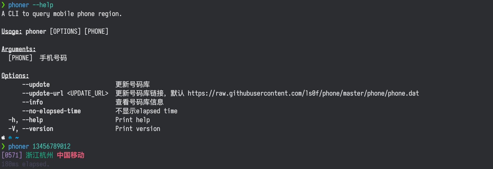

# 手机号码归属地查询

手机号码库来源于[https://github.com/ls0f/phone](https://github.com/ls0f/phone)

执行的时候会自动下载，如果由于网络的原因未下载成功，可手动下载之后放在 `~/.cache/phoner/phone.dat`



## 下载

- [⬇️ 点击下载 x86_64-apple-darwin](https://github.com/bujnlc8/phoner/releases/download/0.1.0/phoner_x86_64-apple-darwin.tar.gz)

  > [phoner_x86_64-apple-darwin.tar.gz.md5](https://github.com/bujnlc8/phoner/releases/download/0.1.0/phoner_x86_64-apple-darwin.tar.gz.md5)

- [⬇️ 点击下载 aarch64-apple-darwin](https://github.com/bujnlc8/phoner/releases/download/0.1.0/phoner_aarch64-apple-darwin.tar.gz)

  > [phoner_aarch64-apple-darwin.tar.gz.md5](https://github.com/bujnlc8/phoner/releases/download/0.1.0/phoner_aarch64-apple-darwin.tar.gz.md5)

- [⬇️ 点击下载 x86_64-unknown-linux-musl](https://github.com/bujnlc8/phoner/releases/download/0.1.0/phoner_x86_64-unknown-linux-musl.tar.gz)

  > [phoner_x86_64-unknown-linux-musl.tar.gz.md5](https://github.com/bujnlc8/phoner/releases/download/0.1.0/phoner_x86_64-unknown-linux-musl.tar.gz.md5)

- ~~[⬇️ 点击下载 x86_64-unknown-linux-gnu](https://github.com/bujnlc8/phoner/releases/download/0.1.0/phoner_x86_64-unknown-linux-gnu.tar.gz)~~

  > ~~[phoner_x86_64-unknown-linux-gnu.tar.gz.md5](https://github.com/bujnlc8/phoner/releases/download/0.1.0/phoner_x86_64-unknown-linux-gnu.tar.gz.md5)~~

请根据你的操作系统下载相应的版本，可对比 md5 hash 值确定是否下载了最新的版本

解压后运行，在 Macos 中如果出现`"phoner" is damaged and can't beopened.`的提示，请尝试执行以下命令:

```
sudo spctl --master-disable
```

**在 Arm 版的 Mac 上如果仍然打不开，可以尝试 x86 的版本**

## 编译

```
cargo build --release --locked
```

**如果在使用过程中发现 bug，欢迎反馈 👏**
